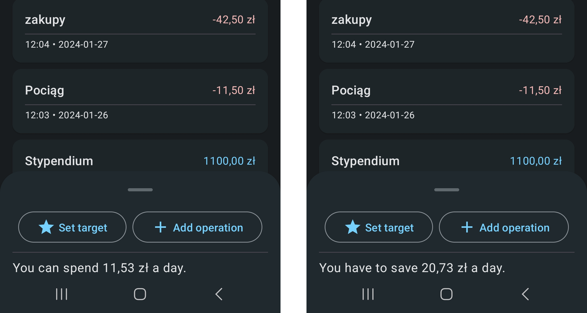

# Budget Guard Project – Client

**Budget Guard** is an engineering-thesis project that showcases an example implementation of a client-server system built with a **RESTful API** architecture.
The server side is a conventional API written in **Java** with **Spring**, while the client side is an Android mobile app developed in **Kotlin** with **Jetpack Compose**.
The system supports user accounts, and every request and response is secured with **JWT** tokens. For end users the project tackles the challenge of mindful planning of day-to-day spending.

The codebase is split into two repositories. This repository contains the **application project**; the [other repository](https://github.com/prax19/budget-guard-api) holds the server component.

## Technical overview

The application follows the **MVVM** (_Model - View - ViewModel_) architecture, which cleanly separates business logic from the UI. Each view has its own ViewModel. This structure was crucial because the app contains many views and may be extended in the future. The diagram below presents the views and the transitions between them.

Another design goal was to apply **Material Design 3** so the app looks consistent with Android and follows well-known design guidelines.
Using **Jetpack Compose** makes it easy to integrate Material components, eliminating the need for custom ones and speeding up development.

For networking the project relies on **GSON**, **Retrofit2**, and **OkHttp3**. These libraries live in the **repository layer**, where they build and send HTTP requests to the server.
Repositories further decouple the communication module from business logic: when a ViewModel needs to add a new item to the database, it simply calls a repository method instead of constructing a request by hand.

Dependency injection is handled by **Dagger Hilt**. Thanks to its integration with Android life-cycle components it was straightforward to create singleton instances of repositories that are initialized at application start-up and injected into ViewModels.

Within Jetpack Compose the **State** component proved extremely useful. Together with a composable view it automatically triggers UI refreshes because the object is observable.
This solution is clean and efficient, and it prevents visual glitches while synchronizing data from the server—the view just updates its properties instead of being recreated.

Securing the API required standard handling of **JWT** tokens in the app.
The token is obtained and stored in encrypted cache during login and then attached by repositories to every request. Each token has an expiration time; when it expires the app redirects the user to the login view for re-authentication.

## Functional overview

After signing in, the user lands on a dashboard that gathers all budgets. Budgets can be linked to an event, savings, or daily expenses.
New budgets are added through a dialog that asks for a name. Budgets are managed with contextual actions by long-pressing a budget item.

The central view is the budget summary. It contains a list of payment operations defined by the user.
The list can be filtered, and at its top the current balance and the change in the selected period are displayed (if a period filter is active). Payment operations are managed in the same way as budgets—through contextual actions.

At the bottom of the view a **BottomSheet** component is available. Expanding it lets the user perform two actions:
1. **Add an operation** – opens a full-size modal dialog where the user sets the operation type, name, date, time, and amount.
2. **Set a financial goal** – lets the user define a goal to reach by a given date, also via a dialog.

After a goal is set, the BottomSheet displays a daily target. The daily target simply tells how much the user can spend each day, or how much needs to be saved daily, so the goal is achieved on time.

