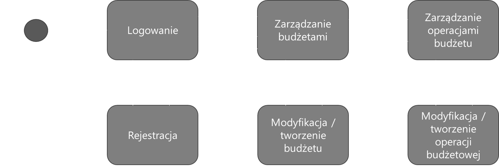
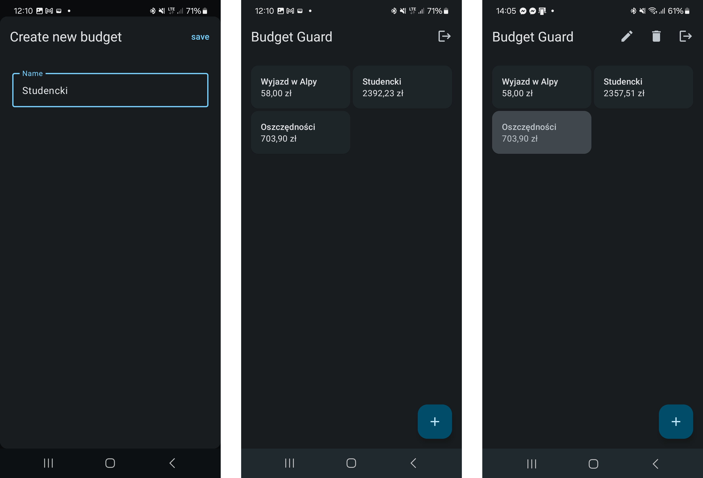
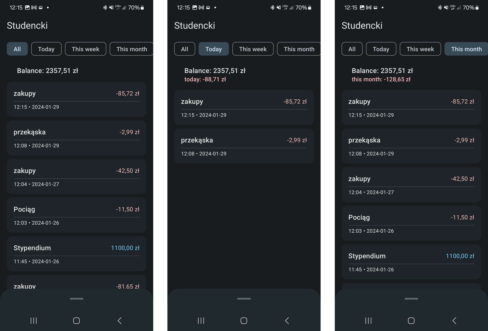
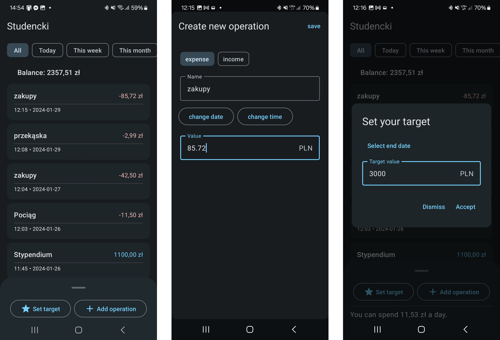
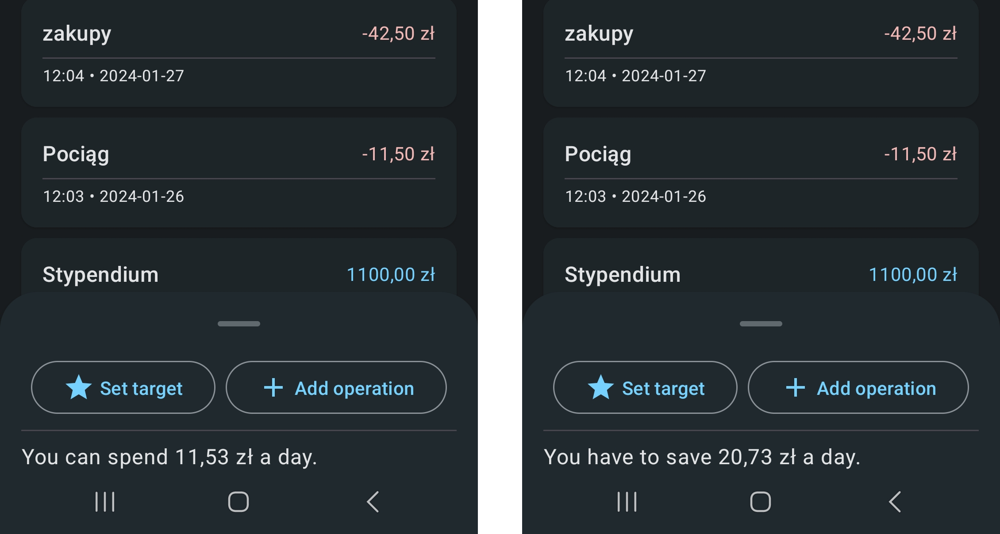

# Projekt Budget Guard - klient

**Budget Guard** to projekt przygotowany w ramach pracy inżynierskiej, skupiający się na przedstawieniu przykładowej implementacji systemu *klient-serwer* z zastosowaniem architektury *RESTful API*. Część serwerowa to klasyczne API przygotowane z wykorzystaniem języka **Java** i frameworku **Spring**, część kliencka z kolei to aplikacja mobilna dla systemu **Android** przygotowana z użyciem języka **Kotlin** oraz narzędzia **Jetpack Compose**. System posiada mechanizm kont, a żądania i odpowiedzi z serwera zabezpieczone są z wykorzystaniem *tokenów JWT*. Projekt na poziomie konsumenckim dotyczy problematyki świadomego planowania bieżących wydatków.

Projekt został rozdzielony na dwa osobne repozytoria. Niniejsze repozytorium zawiera **projekt aplikacji**, z kolei [drugie](https://github.com/prax19/budget-guard-api) — projekt części serwerowej systemu.

## Opis techniczny aplikacji

Aplikacja z założenia miała implementować architekturę **MVVM** (*ang. Model-View-ViewModel*), która zapewnia dobrą separację logiki biznesowej od widoku. Założenie udało się zrealizować m.in. poprzez zastosowanie osobnych komponentów *ViewModel* dla każdego z widoków. Użycie konkretnej architektury było szczególnie istotne ze względu na stosunkowo dużą liczbę widoków oraz potencjalne skalowanie systemu w przyszłości. Poniżej przedstawiono schemat widoków oraz tranzycji między nimi.

Kolejnym założeniem projektu aplikacji klienckiej było zastosowanie **Material Design 3**, dzięki czemu aplikacja jest spójna wizualnie z systemem Android oraz zaprojektowana zgodnie z powszechnie znanymi standardami. Dodatkowo użycie **Jetpack Compose** daje możliwość łatwej implementacji komponentów *Material* w aplikacji, dzięki czemu nie było potrzeby przygotowywania własnych, co zdecydowanie usprawniło pracę.

Do komunikacji zostały zastosowane biblioteki **GSON**, **Retrofit2** oraz **OkHttp3**. Biblioteki te wykorzystywane są w celu formułowania oraz wysyłania zapytań *HTTP* do serwera w warstwie *repozytoriów*. Zastosowanie repozytoriów to kolejny element architektury *MVVM*, który pozwala na odseparowanie modułu odpowiedzialnego za komunikację od logiki biznesowej. *ViewModel* bowiem, na przykład w celu wysłania kolejnego elementu do bazy danych, zamiast ręcznego budowania zapytania *HTTP* wywołuje odpowiednie metody *repozytorium*.

W projekcie wykorzystano także **Dagger Hilt** jako narzędzie do zarządzania mechanizmem wstrzykiwania zależności. Narzędzie to okazało się bardzo użyteczne dzięki integracji z cyklami życia aplikacji, dzięki czemu można było utworzyć na przykład singletony poszczególnych repozytoriów, które były inicjalizowane przy uruchomieniu aplikacji oraz wstrzykiwane do *ViewModeli*.

Bardzo użyteczny w kontekście wykorzystania Jetpack Compose okazał się komponent **State**. Komponent ten, we współpracy z widokiem komponowalnym (*ang. composable*), jest w stanie automatycznie wyzwolić odświeżenie UI. Oznacza to, że obiekt jest obserwowalny (*ang. observable*). Jest to rozwiązanie wyjątkowo czyste oraz wydajne, a także pozwala na uniknięcie problemów z widokiem podczas migracji danych z serwera – stan widoku zamiast tworzyć nową instancję, uaktualnia swoje poszczególne pola. 

Zabezpieczenie API wymagało zaimplementowania w aplikacji mechanizmu obsługującego tokeny **JWT**. Mechanizm ten w tym przypadku jest standardowy i polega na pobraniu oraz zapisaniu tokenu w zabezpieczonej pamięci cache aplikacji przy logowaniu, a następnie wykorzystaniu tego tokenu przez repozytorium do wysyłania żądań. Token ma swój okres ważności; po jego utraceniu aplikacja odsyła użytkownika do ekranu logowania, by ten ponownie się zalogował.

## Opis funkcjonalny

Pierwszym po zalogowaniu użytkownika widokiem aplikacji jest panel gromadzący wszystkie budżety. Mogą to być budżety związane z jakimś wydarzeniem, oszczędnościami czy wydatkami bieżącymi. Użytkownik ma możliwość dodawania kolejnych za pomocą dialogu z pytaniem o nazwę. Budżetami można zarządzać z wykorzystaniem akcji kontekstowych, przytrzymując palcem na poszczególne budżety.

Najistotniejszym widokiem jest podsumowanie budżetu. Podsumowanie to zawiera listę operacji płatniczych, jakie zostały zdefiniowane przez użytkownika. Listę można filtrować, a na jej szczycie znajduje się informacja o aktualnym stanie budżetu oraz zmianie w danym okresie (jeżeli użytkownik filtruje listę względem pewnego okresu). Listą operacji płatniczych da się zarządzać w taki sam sposób jak listą budżetów – za pomocą akcji kontekstowych.

W dolnej części ekranu widoczna jest *dolna karta* (*BottomSheet*), której rozwinięcie pozwala użytkownikowi na podjęcie dwóch akcji. Jedna z nich pozwala na dodanie operacji za pomocą dialogu pełnoekranowego. W dialogu uzupełnia się informacje takie jak typ operacji, nazwę, datę, godzinę oraz wartość. Drugą z akcji jest funkcja ustalania celu finansowego, jaki użytkownik chce osiągnąć do określonej daty. Cel definiowany jest również za pomocą dialogu.

Po ustaleniu celu, w dolnej karcie wyświetlony zostaje cel dzienny dla użytkownika. Cel dzienny polega na zwyczajnym wskazaniu, ile może on wydać dziennie bądź ile powinien on dziennie odłożyć, by cel udało się spełnić.

